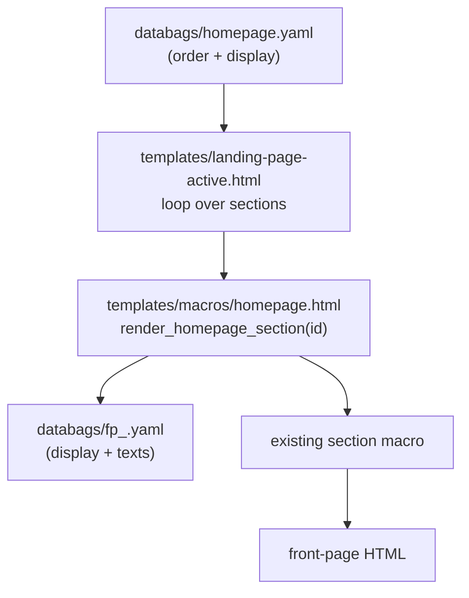

# Front Page (config-driven)

The site has **one always-conference front page**. There is no
recap/inactive mode and no activate/disable switch — the front page
always shows the current (upcoming) conference. Post-event gratitude,
stats, and photos are published as blog posts and archive pages, not
as a front-page state.

The front page is managed entirely from YAML config: one master file
controls which sections appear and in what order; one file per
section holds that section's `display` flag and texts.

## The two config layers

1. **Master — `databags/homepage.yaml`**: an ordered list of
   sections, each with an `id` and a `display: true/false`. This is
   the single place to reorder sections or switch one off.
2. **Section — `databags/fp_<id>.yaml`**: one file per section,
   holding `display: true/false` + the section's texts/structured
   data. This is where you edit content.

A section renders iff **both** its `display` flags are true:
`homepage.yaml` (order/orchestration) AND `fp_<id>.yaml` (local
content). Both default to true.

## Common tasks

**Edit a section's text:** open `databags/fp_<id>.yaml` and change
the fields. Rebuild (`make build`).

**Hide a section:** set `display: false` in `databags/fp_<id>.yaml`
(and/or in `databags/homepage.yaml`). Rebuild.

**Reorder sections:** move the section's entry up or down in
`databags/homepage.yaml`. Rebuild. No template edit.

**Add a new section:**
1. Append an `- id: <new>` entry (with `display: true`) to
   `databags/homepage.yaml`.
2. Create `databags/fp_<new>.yaml` with `display: true` + the
   section's fields.
3. Add one `` branch to
   `templates/macros/homepage.html` that maps the id to a render
   macro.

## Section inventory

| `id` | Config file | Renders |
|------|-------------|---------|
| `intro` | `fp_intro.yaml` | Hero (logo, location, slideshow) |
| `motto` | `fp_motto.yaml` | Motto statement |
| `programme_status` | `fp_programme_status.yaml` | Milestone band (CFP / voting / accepted / schedule) |
| `keydates` | `fp_keydates.yaml` | Key-dates timeline |
| `topics` | `fp_topics.yaml` | Topic pills |
| `keynotes` | `fp_keynotes.yaml` | Revealed-keynote teaser |
| `featured` | `fp_featured.yaml` | Featured speakers/sessions carousel |
| `masterclasses` | `fp_masterclasses.yaml` | Masterclasses carousel |
| `why_attend` | `fp_why_attend.yaml` | Why-attend highlights + testimonials |
| `stats` | `fp_stats.yaml` | Numbers bar |
| `community` | `fp_community.yaml` | Community spotlight |
| `past_editions` | `fp_past_editions.yaml` | Past-editions cards |
| `tickets` | `fp_tickets.yaml` | Tickets CTA (price + struck anchor) |
| `sponsors` | `fp_sponsors.yaml` | Sponsors heading + logo grid (logos from `sponsors.yaml`) |
| `sponsoring` | `fp_sponsoring.yaml` | Sponsoring CTA |
| `newsletter` | `fp_newsletter.yaml` | Newsletter CTA |

> `content/contents.lr` is a minimal record (`_model:
> landing-page-active`, `title`, `full_landing_page: false`). Do not
> put section content there — all visible content lives in the
> `fp_*.yaml` files. The Event/AggregateOffer JSON-LD stays in the
> `landing-page-active.html` structured-data block and reads
> `branding` / `tickets`.

## Pricing on the front page

Ticket prices (UI CTA + `AggregateOffer` schema) are kept in sync by
`make flip-pricing` (early ↔ late). See the tickets section of the
component docs and `utils/flip_pricing.py`.
