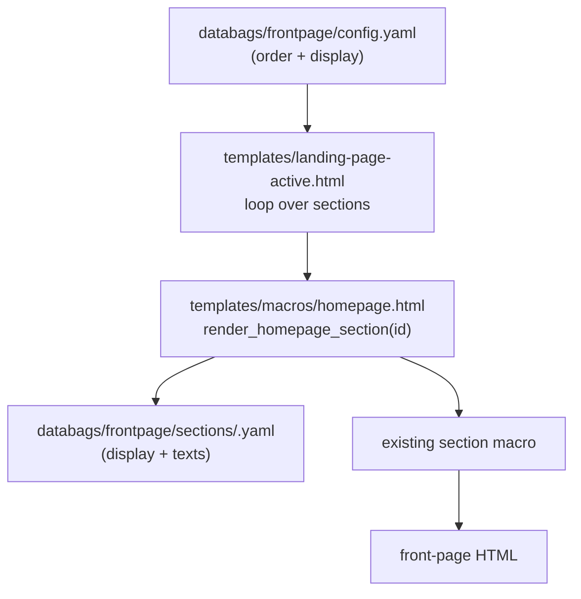

# Front Page (config-driven)

The site has **one always-conference front page**. There is no
recap/inactive mode and no activate/disable switch — the front page
always shows the current (upcoming) conference. Post-event gratitude,
stats, and photos are published as blog posts and archive pages, not
as a front-page state.

The front page is managed entirely from YAML config: one master file
controls which sections appear and in what order; one file per
section holds that section's `display` flag and texts.

## The two config layers

1. **Master — `databags/frontpage/config.yaml`**: an ordered list of
   sections, each with an `id` and a `display: true/false`. This is
   the single place to reorder sections or switch one off.
2. **Section — `databags/frontpage/sections/<id>.yaml`**: one file per section,
   holding `display: true/false` + the section's texts/structured
   data. This is where you edit content.

A section renders iff **both** its `display` flags are true:
`frontpage/config.yaml` (order/orchestration) AND `frontpage/sections/<id>.yaml` (local
content). Both default to true.

```mermaid
flowchart TD
    Master["databags/frontpage/config.yaml\n(order + display)"] --> Loop["templates/landing-page-active.html\nloop over sections"]
    Loop --> Disp["templates/macros/homepage.html\nrender_homepage_section(id)"]
    Disp --> FP["databags/frontpage/sections/<id>.yaml\n(display + texts)"]
    Disp --> Macro["existing section macro"]
    Macro --> HTML["front-page HTML"]
```

## Common tasks

**Edit a section's text:** open `databags/frontpage/sections/<id>.yaml` and change
the fields. Rebuild (`make build`).

**Hide a section:** set `display: false` in `databags/frontpage/sections/<id>.yaml`
(and/or in `databags/frontpage/config.yaml`). Rebuild.

**Reorder sections:** move the section's entry up or down in
`databags/frontpage/config.yaml`. Rebuild. No template edit.

**Link to a section:** set `anchor: <slug>` on its entry in
`databags/frontpage/config.yaml`, then link to `/#<slug>` (for example
`/#key-dates`). The template wraps the section in an element with that id, and
a scroll offset keeps the heading clear of the top nav. Entries without an
`anchor` get no id.

**Add a new section:**

1. Append an `- id: <new>` entry (with `display: true`) to
   `databags/frontpage/config.yaml`.
2. Create `databags/frontpage/sections/<new>.yaml` with `display: true` + the
   section's fields.
3. Add one `` branch to
   `templates/macros/homepage.html` that maps the id to a render
   macro.

**Add an announcement (no template edit):** an announcement is a notice
block such as a call-for-proposals banner. Steps 1 and 2 are the same; in
the section file set `type: announcement`. Skip step 3: ids without an
`elif` branch fall through to the generic announcement dispatch, which
renders `headline`, `subline` and an optional `link_text` / `link_url`
through `templates/macros/announcement.html`. Set `color` to a palette name
(`blue`, `blue-light`, `green`, `yellow`, `orange`, `pink`, `red`); it picks
the `.announcement--<color>` modifier in `assets/static/css/custom.css`.
Position and on/off are controlled by the `config.yaml` entry, as for any section.

## Section inventory

| `id` | Config file | Renders |
| ------ | ------------- | --------- |
| `intro` | `intro.yaml` | Hero (logo, location, slideshow) |
| `motto` | `motto.yaml` | Motto statement |
| `programme_status` | `programme_status.yaml` | Milestone band (CFP / voting / accepted / schedule) |
| `keydates` | `keydates.yaml` | Key-dates timeline |
| `topics` | `topics.yaml` | Topic pills |
| `keynotes` | `keynotes.yaml` | Revealed-keynote teaser |
| `featured` | `featured.yaml` | Featured speakers/sessions carousel |
| `satellite_events` | `satellite_events.yaml` | Satellite events & initiatives carousel + proposal CTA |
| `masterclasses` | `masterclasses.yaml` | Masterclasses carousel |
| `why_attend` | `why_attend.yaml` | Why-attend highlights + testimonials |
| `about` | `about.yaml` | About — community spotlight |
| `past_editions` | `past_editions.yaml` | Past-editions cards |
| `tickets` | `tickets.yaml` | Tickets CTA (price + struck anchor) |
| `sponsors` | `sponsors.yaml` | Sponsors heading + logo grid (logos from `sponsors.yaml`) |
| `sponsoring` | `sponsoring.yaml` | Sponsoring CTA |
| `newsletter` | `newsletter.yaml` | Newsletter CTA |
| `masterclasses-call` | `masterclasses-call.yaml` | Announcement block (`type: announcement`) |

> `content/contents.lr` is a minimal record (`_model:
> landing-page-active`, `title`, `full_landing_page: false`). Do not
> put section content there — all visible content lives in the
> `frontpage/sections/*.yaml` files. The Event/AggregateOffer JSON-LD stays in the
> `landing-page-active.html` structured-data block and reads
> `branding` / `tickets`.

## Pricing on the front page

Ticket prices (UI CTA + `AggregateOffer` schema) are kept in sync by
`make flip-pricing` (early ↔ late). See the tickets section of the
component docs and `utils/flip_pricing.py`.
